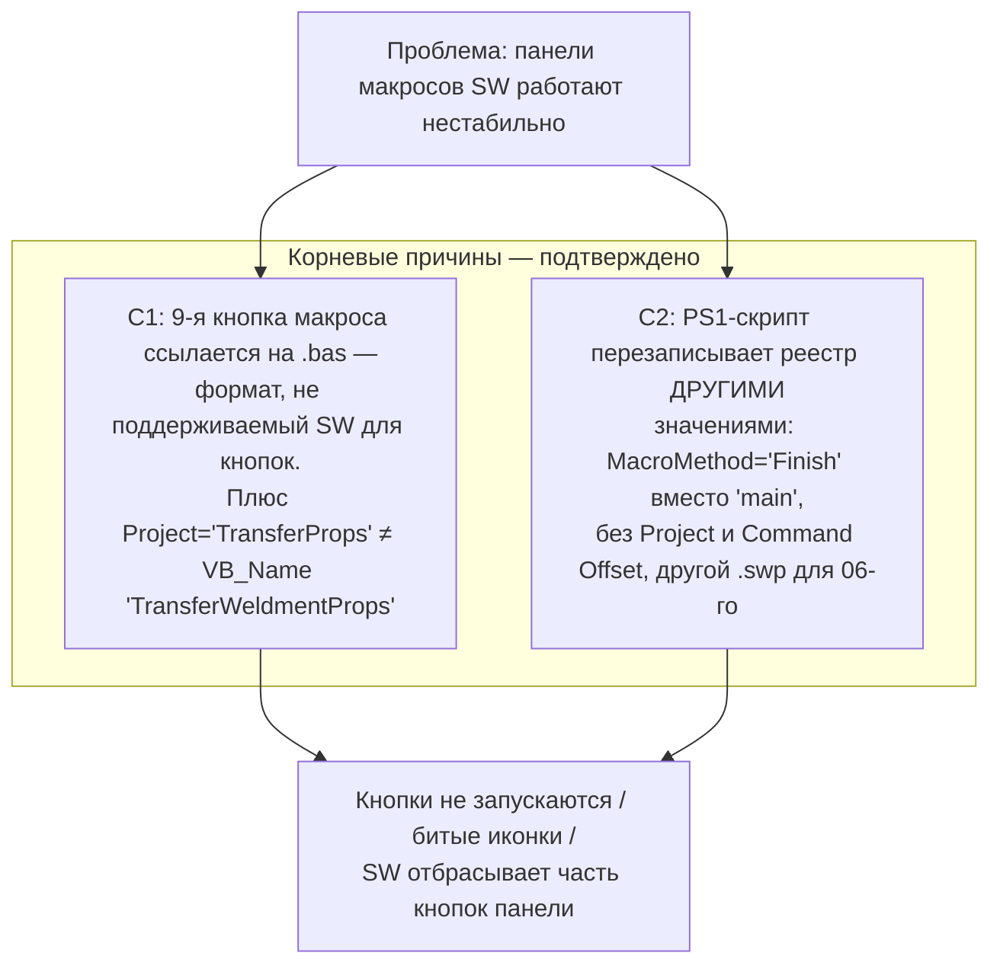

# Аудит инструмента «Настройка_Рабочего_Места_SolidWorks.exe»

**Дата аудита:** 31.08.2026
**Объект:** `Настройка_Рабочего_Места_SolidWorks.exe` (10 380 502 байт), исходник `01_Настройки_SolidWorks/CAD_Workstation_Configurator.py`, конкурирующий скрипт `Setup_Workstation_SolidWorks.ps1`, статический профиль `01_Настройки_SolidWorks/Реестровые_Профили/01_SW2025_Корпоративный_Стандарт_ЕСКД.reg`
**Метод:** статический анализ + верификация байткода сборки + сверка фактического состояния реестра HKCU/HKLM и файловой системы + верификация форматов по документации SolidWorks API

---

## 1. Резюме

**Инструмент в целом работоспособен** (8 из 9 макросов регистрируются корректно, пути к библиотекам/шаблонам/шрифтам записаны верно, Master.ini и MProp обновлены), но содержит **3 критических, 4 высоких и 6 средних дефектов**. Жалоба «проблемы с настройкой панелей макросов» объясняется найденными дефектами C1 и C2.

---

## 2. Идентификация объекта

| Параметр | Значение |
|---|---|
| Тип | PE32+ GUI x86-64, 7 секций |
| Упаковщик | **PyInstaller** (cookie `MEI\x0c\x0b\x0a\x0b\x0e`, onefile) |
| Python | 3.12 (`python312.dll`) |
| Точка входа | `CAD_Workstation_Configurator` (извлечён, 52 328 байт marshal) |
| Соответствие исходнику | **Байткод в exe полностью совпадает** с текущим `CAD_Workstation_Configurator.py` (рекурсивная сверка co_code/co_consts/co_names всех 2 функций и методов класса) — аудит исходника = аудит сборки |
| GUI | Tkinter/TTK, окно 820×680 |

---

## 3. Подтверждённое состояние машины (сверка «что должен писать / что реально записано»)

| Проверка | Результат |
|---|---|
| `User Defined Macros`: 9 подключей `01..09 - Macro Folder`, `Macro Count=9`, `Command Offset=0..8` | ✅ записано |
| `uiMainToolBar_c` = байт-в-байт ожидаемому массиву, хвост — 9 макро-ID `0xE820..0xE828` | ✅ записано |
| `PartTool / AssemblyTool / DrawingTool` → `uiMainToolBar_c=1` | ✅ панель включена во всех контекстах |
| `ExtFolder` — все 13 путей | ✅ все пути существуют на диске (проверено каждый) |
| `General` (русский язык, фон smoke/13813955, Toolbox) | ✅ |
| `Dimensions` (разделитель-запятая 0x2C) + `LineFontWeight` | ✅ |
| RealView AllowList (`Workarounds=0x30408`) | ✅ (ключ жёстко под RTX 5070 Ti) |
| Все 8 пар `.swp`+`.bmp` SWPlus, включая точный регистр имён (`TT.SWP`, `TT.BMP`) | ✅ существуют |
| `Master.ini` строка [3] = путь к «Основные надписи» | ✅ обновлён |
| `MProp_Fam.txt` / `MProp_Firm.txt` (cp1251) | ✅ «Лунин В.И.» / «Home Made» |
| Аварийный add-in OnCad `{03412BA8-…}` в `AddInsStartup` | ✅ отсутствует (удалён) |

**Вывод:** на момент аудита GUI-инструмент отработал успешно. Проблемы панелей создаются дефектами ниже.

---

## 4. Дефекты

### КРИТИЧЕСКИЕ

#### C1. 9-я кнопка макроса неработоспособна по конструкции (`.bas`)
`get_macro_definitions()` регистрирует кнопку `09 - Macro Folder`:
`Source Path = …\Перенос_Свойств_Сварных_Деталей\TransferWeldmentProps.bas`, `Project="TransferProps"`, `Method="main"`.

Две независимые причины отказа:
1. **SolidWorks не поддерживает `.bas` как запускаемый файл макроса.** Поддерживаемые форматы — `.swp` (VBA), `.swb` (SWBasic), `.dll` (VSTA) — подтверждено документацией (CodeStack: SOLIDWORKS Macro types; справка SW: «Files of type: SW VBA Macros (*.swp)»). `.bas` — это исходник модуля, который можно лишь импортировать внутрь `.swp`.
2. **Несовпадение имени модуля:** в файле `Attribute VB_Name = "TransferWeldmentProps"`, а в реестр пишется `Project="TransferProps"`. Даже при поддержке формата SW не нашёл бы метод `TransferProps.main`.

Следствие: SW при загрузке панели не может разрешить команду `0xE828`; в зависимости от версии — кнопка с «пустой» иконкой, ошибка «не найден макрос/метод», либо SW отбрасывает недействительный хвост `uiMainToolBar_c`.

**Исправление:** обернуть код в запускной формат и согласовать имя модуля. Быстрый путь — сохранить как `TransferWeldmentProps.swb` (SWBasic — текстовый формат, совместимый по синтаксису с модулем; файл в cp1251, SWBasic это допускает) и в определении макроса указать `Project="TransferWeldmentProps"`, `MacroMethod="main"`, путь до `.swb`. Альтернатива — один раз открыть в SW «Tools → Macro → New», импортировать `.bas`, сохранить `TransferWeldmentProps.swp`.

#### C2. Конфликт двух настройщиков: PS1-скрипт ломает реестр, который пишет GUI
`Setup_Workstation_SolidWorks.ps1` (шаг [2/4]) перезаписывает `User Defined Macros` **другими** значениями:

| Кнопка | GUI exe / статический reg (корректно) | PS1 (ломает) |
|---|---|---|
| 01–05, 07, 08 | `MacroMethod="main"` | `MacroMethod="Finish"` — метода `Finish` в макросах нет |
| все | `Project="<модуль>"` | **не пишет вовсе** |
| все | `Command Offset=0..8` | **не пишет вовсе** → ID кнопок `0xE820+N` в `uiMainToolBar_c` теряют привязку к макросам |
| 06 | `Roughness.swp` | `Roughness multi.swp` (другой файл) |
| 09 | `.bas` (дефект C1) | `.bas` + `Method="main"` |

Любой запуск PS1 после GUI (или наоборот) даёт «плавающие» симптомы: часть кнопок не реагирует, не те макросы, иконки слетают — именно профиль жалобы «проблемы с настройкой панелей макросов».

#### C3. PS1 самопротиворечив: статический reg затирает динамические пути
Шаг [2/4] PS1 формирует пути от `$PSScriptRoot` (заявлена работа «с любого диска/UNC»), но шаг [3/4] импортирует статический `01_SW2025_Корпоративный_Стандарт_ЕСКД.reg` с **жёсткими** путями `d:\Work\_Инструменты_Конструктора\…`, который перезаписывает только что созданные динамические пути (включая все 9 макросов). На любом другом ПК/сетевом расположении после PS1 реестр будет ссылаться на несуществующий `d:\Work\…`.

### ВЫСОКИЕ

#### H1. Чекбоксы настроек — обманки
В `apply_configuration()` не читаются `var_opt_top_bar`, `var_opt_lang`, `var_opt_colors`, `var_opt_realview` — язык, фон, панели и макросы пишутся **всегда**, как будто все чекбоксы включены. Реально работает только `var_opt_fonts`. Снять «Зарегистрировать все 9 макросов и настроить верхнюю панель» невозможно. (В `generate_reg_content()` `var_opt_colors`/`var_opt_realview` учтены — поведение кнопок «Применить» и «Экспорт в .reg» расходится.)

#### H2. «ПРИМЕНИТЬ НАСТРОЙКИ» пишет лишь часть конфигурации
Прямая запись winreg в `apply_configuration()` не пишет то, что есть в .reg-экспорте:
- `Toolbars\uiMacroToolBar_c`;
- `Toolbars\PartTool / AssemblyTool / DrawingTool` → **флаги видимости панелей**: на машине, где верхняя панель выключена (по умолчанию в свежем профиле это не гарантировано), кнопки макросов окажутся записанными, но невидимыми — «панель не настроилась»;
- `General-Bar1` (структура меню/панелей), `General-Bar26`;
- всю ветку **HKLM** (`Use English language`, `Language`);
- **RealView AllowList** (чекбокс «Аппаратный RealView» через «Применить» не работает вообще);
- `Witness Gap/Witness Ext`, `Move sketch entities…`, `Detach Segment On Drag`.

На чистой машине без «СБРОСА ДО ЗАВОДСКИХ» результат «Применить» ≠ результату импорта reg-файла.

#### H3. Повторное применение не чистит старые макросы
`apply_configuration()` не удаляет существующее дерево `User Defined Macros` (в reg-экспорте для этого есть `[-HKEY…]`, в winreg-коде — нет). Если ранее макросов было больше 9 или с другими именами подключей — останутся хвосты при `Macro Count=9`: SW отображает неверный список / дубли / битые кнопки. Корректно только после «полного сброса».

#### H4. Рассинхрон `General-Bar1`: `Bars=108` при 102 парах `Bar#N`
В статическом reg (и в генераторе) объявлено `"Bars"=dword:0000006c` (108), фактических пар `Bar#0..Bar#101` — 102 (дамп обрезан на 6 пар при ручном составлении). SW читает панели по счётчику → 6 фантомных записей; записи, попавшие в обрезанный хвост живого профиля, теряются. Нужно либо `Bars=102`, либо дампить полный набор пар.

### СРЕДНИЕ

| # | Дефект | Детали |
|---|---|---|
| M1 | Шрифты не регистрируются постоянно | Копия в `C:\Windows\Fonts` + `AddFontResourceW` + `WM_FONTCHANGE`, но **нет записи в `HKLM\…\Windows NT\CurrentVersion\Fonts`** → после перезагрузки шрифт не подхватится. Требуются права администратора (не проверяются). PS1 вообще только копирует файлы, сообщая «зарегистрированы». Корректно: запись в реестр шрифтов, либо user-level установка (`%LOCALAPPDATA%\Microsoft\Windows\Fonts` + HKCU) при отсутствии прав |
| M2 | Жёстко зашитые пути | `Toolbox Data Location=D:\Work\_Toolbox`; материалы `C:\Program Files\…`, `C:\ProgramData\…`; RealView-ключ только для «NVIDIA GeForce RTX 5070 Ti/PCIe/SSE2». На другой машине/видеокарте — тихий отказ. GPU можно определять через WMI `Win32_VideoController` |
| M3 | Экспорт .reg без финального перевода строки | `"\n".join(reg)` — последний ключ (`Bar#101`) не завершён `\r\n`; regedit может отказаться импортировать или молча потерять последнюю запись. Статический reg в комплекте завершается `\n` — генератор с ним расходится |
| M4 | Слепая правка `Master.ini` по индексу | `lines[3] = путь` без проверки, что там путь (формат файла изменится — тихая порча). То же в PS1. Работает сейчас (проверено), но хрупко |
| M5 | Сброс: пропуск ключей AddInsStartup | `EnumKey(k, i)` при одновременном `DeleteKey` в том же ключе — индексный сдвиг, при >1 совпадении часть ключей пропускается; исключение глотается молча. Корректно: собирать имена, затем удалять |
| M6 | `taskkill /F` без предупреждения | Убивает SLDWORKS.exe с несохранёнными документами. В `apply_configuration` — вообще без подтверждения (подтверждение есть только в полном сбросе, и там про потерю данных не сказано) |

### НИЗКИЕ

| # | Дефект |
|---|---|
| L1 | `find_tools_root()` — fallback жёстко `D:\Work\_Инструменты_Конструктора` |
| L2 | Валидатор проверяет только 6 каталогов; реально пишутся ещё «Профили резьбы», «База шаблонов», «Шаблон списка вырезов», «Шаблон таблицы сварных швов», «Часто используемые…» (все существуют, но контроль неполный) |
| L3 | Emoji (🔴💾🚀) в ttk-кнопках — на системах без Segoe UI Emoji отобразятся квадратиками |
| L4 | `.bas` сохранён в cp1251 — учесть при конвертации в `.swb`/`.swp` |

---

## 5. Рекомендации (по приоритету)

1. **Починить 9-ю кнопку** (C1): конвертировать `TransferWeldmentProps.bas` → `.swb` (или `.swp`), в `get_macro_definitions()` указать `Project="TransferWeldmentProps"`, `MacroMethod="main"` и новый Source Path. Иконку `MProp.bmp` временно допустимо оставить.
2. **Устранить конфликт PS1** (C2/C3): либо удалить `Setup_Workstation_SolidWorks.ps1` (GUI exe его полностью покрывает), либо синхронизировать: `MacroMethod="main"`, `Project` и `Command Offset` для всех 9, убрать импорт статического reg поверх динамических путей (генерировать полный reg динамически, как в GUI).
3. **`apply_configuration()`**: перед записью макросов удалять дерево `User Defined Macros` (H3); дописать `uiMacroToolBar_c`, `PartTool/AssemblyTool/DrawingTool`, `General-Bar1`, `General-Bar26`, `AllowList` (H2); honour все чекбоксы (H1); HKLM-ветку писать через elevation с явным сообщением.
4. **`General-Bar1`**: выставить `Bars=102` (H4) или восстановить полные 108 пар из живого дампа.
5. **Шрифты**: регистрировать в реестре шрифтов + `WM_FONTCHANGE`, с user-level fallback (M1).
6. **Экспорт .reg**: добавлять финальный `\r\n` (M3).
7. **Динамизировать** Toolbox/материалы/RealView-ключ (определение GPU через WMI) (M2); перед `taskkill /F` — предупреждение о несохранённых документах (M6).

---

## 6. Вердикт

Инструмент **не готов к распространению как единственный корпоративный настройщик** в текущем виде: 9-я кнопка макроса гарантированно нерабочая (C1), а наличие в пакете PS1-скрипта с другими значениями (C2) делает конфигурацию недетерминированной — каждый запуск другого инструмента даёт разное состояние панелей. Основной сценарий (8 макросов SWPlus + библиотеки + ЕСКД + шрифты) на данной машине отрабатывает корректно, что подтверждено сверкой реестра и файлов. После устранения C1–C3 (точечные правки в одном файле определений макросов и удаление/синхронизация PS1) и H2–H3 инструмент пригоден к тиражированию.
