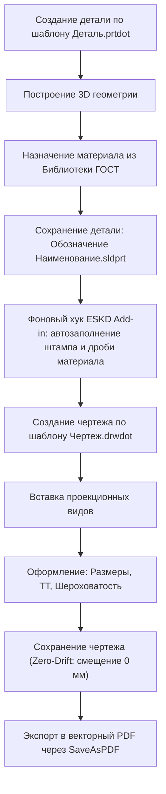

# 📖 Руководство пользователя и администратора САПР: Программный комплекс «Инструменты Конструктора»

Настоящее руководство предназначено для инженеров-конструкторов, расчетчиков, выпускающих специалистов и администраторов САПР SolidWorks, эксплуатирующих корпоративный стандарт автоматизации оформления документации по ЕСКД.

---

# ЧАСТЬ I. РУКОВОДСТВО ИНЖЕНЕРА-КОНСТРУКТОРА

## 1. Обзор рабочего пространства и панелей инструментов

После выполнения первоначальной настройки рабочего места в SolidWorks активируются два основных элемента управления:

### 1. Вкладка ленты CommandManager «ЕСКД»
Вкладка доступна во всех трех типах документов: **Деталь (`swDocPART`)**, **Сборка (`swDocASSEMBLY`)** и **Чертеж (`swDocDRAWING`)**.
* **Синхронизировать свойства**: принудительный пересчет массы, обновление свойств штампа и форматирование материала.
* **Настройки ЕСКД**: вызов диалогового окна параметров конструктора (фамилии, организация, правила форматирования массы и деления имен).
* **Синхронизация ТТ**: привязка базы технических требований к текущему чертежу.

### 2. Панель быстрого доступа (QAT) — 9 кнопок макросов SWPlus
В верхней строке интерфейса SolidWorks закреплены 9 кнопок инженерных макросов:
1. **MProp** (`Btn11`): редактор реквизитов деталей и сборок.
2. **SProp** (`Btn12`): оформление стандартных и покупных изделий (крепеж, покупные узлы).
3. **DProp** (`Btn13`): свойства чертежа и листа.
4. **SpecEditor** (`Btn14`): генерация и редактирование спецификаций по ГОСТ 2.106.
5. **RecordDimM** (`Btn15`): управление допусками и посадками размеров.
6. **Roughness** (`Btn16`): расстановка знаков неуказанной и локальной шероховатости по ГОСТ 2.309.
7. **TT** (`Btn17`): мастер технических требований по ГОСТ 2.316.
8. **Master** (`Btn18`): оперативная смена формата листа и основной надписи.
9. **SaveAsPDF** (`Btn19`): экспорт чертежей в векторный PDF.

---

## 2. Сквозной рабочий процесс проектирования детали



### Шаг 1. Создание новой детали
1. Нажмите `Файл -> Создать -> Деталь.prtdot` (вкладка корпоративных шаблонов).
2. Шаблон изначально содержит настроенные проекции, единицы измерения (мм, граммы), точность и привязки свойств к штампу.

### Шаг 2. Назначение материала по ГОСТ
1. В дереве конструирования щелкните правой кнопкой мыши по пункту **«Материал»** -> **«Редактировать материал»**.
2. В появившемся окне раскройте раздел **«Библиотека_Материалов_ГОСТ»**.
3. Выберите нужную марку, например:
   `Труба 80х80х4 ГОСТ 8639-82 / Ст3сп ГОСТ 380-2005` или `Лист 4,0 ГОСТ 19903-2015 / Ст3сп ГОСТ 14637-89`.
4. Нажмите **«Применить»**.
5. Служба ЕСКД автоматически сформирует свойство `Материал_ФБ` со строкой двухэтажной дроби:
   ```
   <STACK>Труба 80х80х4 ГОСТ 8639-82<OVER>Ст3сп ГОСТ 380-2005</STACK>
   ```

### Шаг 3. Именование файла и сохранение
Для автоматического распознавания реквизитов сохраняйте файл детали по стандарту:
```
[Децимальный номер] [Наименование детали].sldprt
```
*Примеры корректных имен файлов:*
* `АБВГ.123456.001 Втулка.sldprt`
* `АБВГ.123456.002-01 Корпус.sldprt` (для исполнений с дефисом)
* `АБВГ.123456.003 01 Кронштейн.sldprt` (для исполнений через пробел)

При сохранении (`Ctrl+S`) служба ЕСКД автоматически:
* Запишет в свойства `Обозначение`: `АБВГ.123456.001`;
* Запишет в свойство `Наименование`: `Втулка`;
* Рассчитает точную массу детали с учетом плотности назначенного ГОСТ-материала;
* Запишет организацию и фамилию конструктора во все конфигурации детали.

---

## 3. Работа со стандартными и покупными изделиями (SProp)

> [!IMPORTANT]
> Если вы создаете крепеж, заказываемый узел или деталь из стороннего каталога, ее обозначение и наименование не должны зависеть от имени файла или перезаписываться фоновыми алгоритмами ЕСКД!

### Оформление через макрос SProp:
1. Откройте деталь стандартного изделия.
2. Нажмите кнопку **SProp** на верхней панели (`Btn12`).
3. В окне SProp выберите нужный раздел:
   - **«Стандартные изделия»** (болты, гайки, винты, подшипники);
   - **«Прочие изделия»** (двигатели, насосы, готовые модули по каталогу поставщика).
4. Заполните поля «Наименование по каталогу», «Поставщик», «Код продукции».
5. Нажмите кнопку «Применить».
6. **Защита ESKD Add-in**: при любом последующем сохранении надстройка ЕСКД распознает маркеры стандартного изделия и **пропустит** деталь без изменения реквизитов, сохранив оригинальные каталожные данные.

---

## 4. Оформление чертежей и механизм Zero-Drift

### Шаг 1. Создание чертежа
1. Выполните `Файл -> Создать чертеж из детали` (или выберите шаблон `Чертеж.drwdot`).
2. При необходимости изменить формат листа нажмите кнопку **Master** (`Btn18`) на верхней панели и выберите требуемый формат (от `A4-P` до `A0-A`).

### Шаг 2. Размещение видов и штамп
1. Перетащите на лист модель детали/сборки.
2. Основная надпись (штамп) чертежа автоматически заполнится данными из 3D-модели через `$PRPSHEET`:
   - Обозначение и Наименование;
   - Двухэтажная дробь сортамента материала с чертой деления;
   - Масса (с единицей «кг» или без в зависимости от настройки);
   - Фамилия конструктора в графе «Разраб.»;
   - Название организации в графе штампа.

### Шаг 3. Технические требования (макрос ТТ)
1. Нажмите кнопку **ТТ** на верхней панели (`Btn17`).
2. В окне макроса выберите нужные типовые пункты (термообработка, неуказанные предельные отклонения, покрытие).
3. Нажмите «Записать в чертеж». Пункты автоматически разместятся над основной надписью с нумерацией по ГОСТ 2.316.

### Шаг 4. Неуказанная шероховатость (макрос Roughness)
1. Нажмите кнопку **Roughness** (`Btn16`).
2. Задайте знак общей неуказанной шероховатости (например, $\sqrt{Ra 6,3} (\sqrt{})$).
3. Нажмите «Применить» — знак закрепится в правом верхнем углу чертежа по ГОСТ 2.309.

### Шаг 5. Сохранение чертежа (Zero-Drift)
При нажатии `Ctrl+S` или экспорте в чертеже SolidWorks координаты всех текстовых заметок остаются неизменными:
$$\Delta X = 0.0000 \text{ мм}, \quad \Delta Y = 0.0000 \text{ мм}$$
Штамп и надписи никогда не смещаются и не наползают на линии рамки.

### Шаг 6. Экспорт в PDF (макрос SaveAsPDF)
1. Нажмите кнопку **SaveAsPDF** (`Btn19`).
2. Макрос использует нативный векторный экспорт SolidWorks: формирует высококачественный PDF с сохранением текстовых слоев и весов линий в подпапку `.\PDF\`.

---

## 5. Настройка параметров конструктора (Окно ЕСКД)

Для вызова окна настроек перейдите на вкладку **«ЕСКД»** в CommandManager и нажмите кнопку **«Настройки»** (или запустите утилиту `03_Макросы_и_Плагины/ESKD_Material_Sync_Addin/ESKD.exe`):

1. **Разработчик / Автор**: введите вашу фамилию с инициалами (например, `Лунин В.И.`). Она будет автоматически заноситься в графу «Разраб.» при создании и сохранении моделей.
2. **Организация / Предприятие**: укажите наименование компании (например, `ТОО "Троя"`). Настройка синхронно обновляется во всех профилях `MProp` и свойствах штампа.
3. **Авторасчет массы**:
   - Чекбокс «Пересчитывать массу при сохранении»;
   - Точность: количество знаков после запятой (рекомендуется `2` для кг).
4. **Автоматическое деление имени файла**: включает распознавание децимального номера и наименования из имени сохраняемого файла.
5. Нажмите **«Применить сейчас»** — новые реквизиты запишутся в текущий документ (и в 3D-модель первого вида, если открыт чертеж), а также сохранятся в реестре текущего пользователя.

---

# ЧАСТЬ II. РУКОВОДСТВО АДМИНИСТРАТОРА САПР

## 1. Развертывание корпоративного стандарта на рабочих станциях

### Автоматическое развертывание скриптом PowerShell
Скрипт `01_Настройки_SolidWorks/Setup_Workstation_SolidWorks.ps1` выполняет сквозное конфигурирование рабочего места:

```powershell
# Запуск от имени Администратора для полной системной интеграции:
powershell -ExecutionPolicy Bypass -File "d:\Work\_Инструменты_Конструктора\01_Настройки_SolidWorks\Setup_Workstation_SolidWorks.ps1"
```

#### Параметры скрипта:
* `-Author "Фамилия И.О."`: фамилия конструктора по умолчанию (если не задан, считывается из текущего реестра или ставится `Лунин В.И.`);
* `-Firm "Название Компании"`: наименование предприятия;
* `-ToolsRoot "D:\Путь\К_Инструментам"`: явное указание каталога пакета (по умолчанию определяется автоматически по расположению скрипта).

### Что конфигурирует скрипт:
1. **Шрифты ЕСКД**: копирует файлы `GOST type A.ttf` и `GOST type B.ttf` в `%SystemRoot%\Fonts`.
2. **Пути поиска SolidWorks (`ExtReferences`)**:
   - Форматы листов (`Sheet Format Folders`): `03_Макросы_и_Плагины/Макросы_SW_ZTool/SWPlusMacro_v_2018_SP0.0/Основные надписи` — единственный комплект форматок (прежняя копия «База шаблонов» перенесена в `99_Архив/Архив_форматок`);
   - Шаблоны документов (`Document Template Folders`): `02_Шаблоны_и_Форматки/Шаблоны документов`;
   - Библиотека материалов: `04_Библиотеки_Материалов_и_Профилей/Библиотека материалов`;
   - Профили сварных деталей: `04_Библиотеки_Материалов_и_Профилей/Сварные детали`;
   - Шаблоны свойств Task Pane: `02_Шаблоны_и_Форматки/Шаблоны свойств`.
3. **Реестровые настройки SolidWorks 2025**:
   - Импортирует корпоративный эталонный профиль `01_SW2025_Корпоративный_Стандарт_ЕСКД.reg` с автоматической подстановкой реальных путей к диску установки;
   - Отключает нестабильный режим `Enhanced Graphics Performance (Use Performance Pipeline 2020 = 0)`;
   - Привязывает базу данных крепежа SolidWorks Toolbox.
4. **COM-надстройка ЕСКД v5**:
   - Регистрирует CLSID `{B64E6875-B101-4D5C-B245-FF8D50772E25}` в `HKCU\Software\Classes\CLSID` (для запуска без прав локального администратора);
   - Добавляет запись автозагрузки в `HKCU\Software\SolidWorks\AddInsStartup\{B64E6875-...}`;
   - Если скрипт запущен от администратора, дополнительно регистрирует библиотеку через `RegAsm.exe /codebase` в `HKLM`.
5. **Интерфейс CommandManager и QAT**:
   - Фиксирует видимость вкладки `ЕСКД` (`Tab Props = "ЕСКД,1,1,-1"`, `Visible = 1`) в `PartContext`, `AssyContext` и `DrwContext`;
   - Закрепляет 9 кнопок макросов в верхней строке быстрого доступа (`QAT\GB0: Btn11..Btn19`, ID `33639..33647`).
6. **Синхронизация профилей SWPlus**:
   - Обновляет списки `MProp_Fam.txt` и пары организаций `MProp_Firm.txt` (с сохранением четных строк кодов ОКПО);
   - Привязывает `Master.ini` к каталогу основных надписей.

---

## 2. Сборка и сопровождение COM-надстройки из исходных кодов

Каталог: `03_Макросы_и_Плагины/ESKD_Material_Sync_Addin/`

Надстройка написана на C# и скомпилирована под **.NET Framework 4.0 / 4.8**.  
Для сборки **не требуется установка Visual Studio**. Достаточно системного компилятора `csc.exe`, входящего в состав Windows.

### Сборка и регистрация:
```powershell
powershell -ExecutionPolicy Bypass -File ".\03_Макросы_и_Плагины\ESKD_Material_Sync_Addin\build_and_register.ps1"
```

### Состав исполняемых файлов:
* **`ESKD_Material_Sync_v5.dll`**: COM In-process сервер (надстройка SolidWorks);
* **`ESKD.exe`**: Оконное приложение настроек конструктора (WinForms);
* **`ESKD_Sync.exe`**: Консольная утилита для вызова синхронизации из внешних скриптов CI/CD или пакетной обработки.

---

## 3. Управление базами материалов и профилей сварных деталей

### 1. Добавление новых материалов в `Библиотека_Материалов_ГОСТ.sldmat`
Файл базы материалов представляет собой структурированный XML. Каждая запись материала содержит физические свойства (плотность, предел текучести, теплопроводность) и специализированные классификаторы:
```xml
<material name="Труба 80х80х4 ГОСТ 8639-82 / Ст3сп ГОСТ 380-2005">
    <physicalproperties>
        <density value="7850"/>
    </physicalproperties>
    <custom>
        <prop name="Сортамент" value="Труба 80х80х4 ГОСТ 8639-82"/>
        <prop name="Марка_Материала" value="Ст3сп ГОСТ 380-2005"/>
        <prop name="Дробь_Материала" value="&lt;STACK&gt;Труба 80х80х4 ГОСТ 8639-82&lt;OVER&gt;Ст3сп ГОСТ 380-2005&lt;/STACK&gt;"/>
    </custom>
</material>
```
> [!NOTE]
> При добавлении материалов, требующих двухэтажной дроби по ГОСТ 2.104, используйте экранированные теги `&lt;STACK&gt;` и `&lt;OVER&gt;`.

### 2. Добавление профилей сварных конструкций
Профили сварных деталей хранятся в формате библиотечных элементов SolidWorks (`.sldlfp`) по иерархии:
`04_Библиотеки_Материалов_и_Профилей/Сварные детали/[Стандарт]/[Тип профиля]/[Размер].sldlfp`
*Пример:*
`Сварные детали/ГОСТ/Труба профильная/80 x 80 x 4.sldlfp`

---

## 4. Регулярный аудит и контроль качества

Перед развертыванием изменений на компьютеры пользователей администратор запускает автотесты из корня репозитория.
SolidWorks на станции должен быть закрыт: тесты поднимают собственную сессию и откажутся работать при запущенном SolidWorks.
```powershell
python .\09_Тесты\run_tests.py full
```

### Состав проверок
1. **T0 — статика** (без SolidWorks): батник установки, словарь SWPlus, согласованность библиотеки материалов,
   шаблоны вкладки свойств, профиль реестра, единый модуль регистрации, сборка надстройки из текущих исходников.
2. **T1 — юнит-тесты ядра C#**: разбор имени файла и исполнений, правило происхождения обозначения, разметка граф,
   запись «Деталь БЧ», словарь, кэш библиотеки материалов, план очистки файлов v5.
3. **T2 — контракт SolidWorks**: измеренная последовательность событий сохранения — основа точек записи надстройки.
4. **E2E** на фикстурах корпуса А: персистентность реквизитов (P), модель свойств (M), безчертёжные детали (B),
   основная надпись по ГОСТ 2.104 и нулевое смещение заметок (D), очистка файлов v5 (R), шаблоны и перезагрузка
   надстройки (I). Оракул — состояние файла на диске, прочитанное при выключенной службе надстройки.

Отчёт каждого прогона — `08_Результаты_Тестирования/runs/<дата_время>/report.md`; известные дефекты и их статус —
`09_Тесты/defects.json`. Числа проверок берутся из отчёта прогона.
